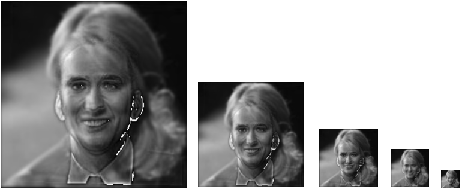
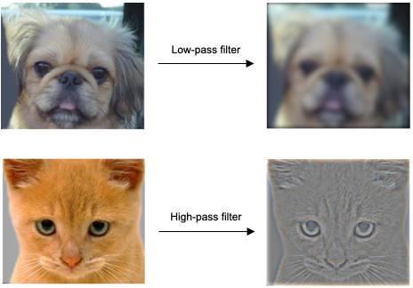

# HybridImages
Hybrid images are special types of images which takes advantage of perceptual grouping to change the meaning of an image as viewing distance is changed [[MIT Publication]](hybrid-images-mit-paper.pdf).

The following is an example of a hybrid image that has been downsampled which makes it clear to understand a hybrid image without having to walk further away from your screen.

A hybrid image is obtained by taking two images and adding a low frequency version of one to a high frequency version of another. 

A low frequency image is obtained by running a low-pass filter on an image. A high frequency image can be obtained by running a high pass filter on an image. Examples of applying a low and high pass filter is shown below.

An image is filtered by applying an operation called convolution. We take a matrix of odd numbered dimensions, called the kernel, (so it has an element in the centre) overlay it on top of the image and multiply element-wise. The multiplied elements are summed and becomes a single element representing a pixel in the output matrix. The kernel performs a [raster scan](https://en.wikipedia.org/wiki/Raster_scan) during convolution, as shown in the animation below.

Source: [An intuitive guide to Convolutional Neural Network - freeCodeCamp](https://www.freecodecamp.org/news/an-intuitive-guide-to-convolutional-neural-networks-260c2de0a050/)

In the example above, note the dotted line around the image (blue). This is padding so that the kernel does not 'fall-off'. In this implementation, zero-padding is used. A good explanation can be found in [DeepLizard](https://deeplizard.com/learn/video/qSTv_m-KFk0).

More generally, matrix convolution is defined as:

in this example, we think of X as the input image and Y as the kernel.

The values inside the kernel determine the type of image filtering we perform. In the example figure below, the kernel represents a [Sobel operator](https://en.wikipedia.org/wiki/Sobel_operator), which is commonly used for [edge detection](https://en.wikipedia.org/wiki/Edge_detection). A list of common kernels can be found in [Wikipedia](https://en.wikipedia.org/wiki/Kernel_(image_processing)#Convolution).

Source: [freeCodeCamp](https://www.freecodecamp.org/news/an-intuitive-guide-to-convolutional-neural-networks-260c2de0a050/)

To create hybrid images, [Gaussian blur](https://en.wikipedia.org/wiki/Gaussian_blur) is used. This convolves an input image with a [Gaussian function](https://en.wikipedia.org/wiki/Gaussian_function) which is visualised below. This function accepts a parameter, sigma, which in the context of image convolution means how much to blur an image.

## Usage
This package only relies on numpy to perform all kinds of convolution. The unit tests make use of [scipy.signal.convolve2d](https://docs.scipy.org/doc/scipy/reference/generated/scipy.signal.convolve2d.html) as a basis for comparison and checking correctness.

[matplotlib](https://matplotlib.org) is required to visualise images and [Pillow](https://pillow.readthedocs.io/en/stable/) is used to load image files.

See ``Harness.py`` for a self contained example. It also contains some helper methods for common image operations such as loading, viewing and saving. 
